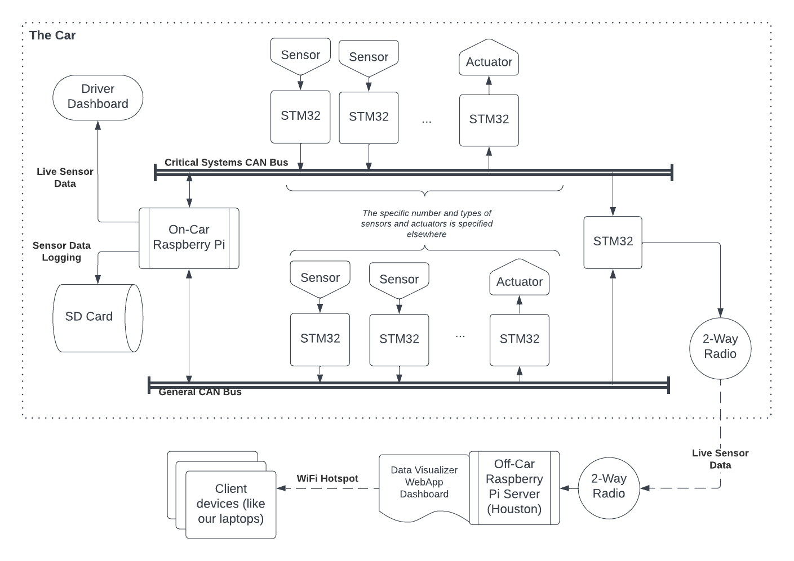

# Tufts Electric Racing Teams' 2025-26 Sensors & Microcontrollers GitHub Repository

This repository is contains contains the code for 
the Tufts Electric Racing's Sensors & Microcontrollers subteam
for the 2025/2026 academic year.

## The Shape of our System

## The Shape of this Repository
The layout of this repository corresponds roughly to the
physical layout of the hardware on the car. In general subdirectory
corresponds to a physical part of our system's architecture, except those
beginning with dots (e.g. .assets which contains the images used
by this README)

The current directory structure of this repository is:

    . <- YOU ARE HERE
    ├── houston
    │   └── webapp 
    ├── onboard-rpi
    │   ├── canbus-readers
    │   └── 
    ├── README.md
    └── stm
        └── README.md

## Contribution Guidelines and Conventions
* Each directory should include a README specifying its purpose and 
  its own structure
* Each source code file should contain a header comment specifying its purpose
* Development should happen in a development branch, and make a merge request
  only when code has been thoroughly tested and is ready to be used
* Again: **COMMITS SHOULD NOT BE MADE DIRECTLY TO MAIN**
* Code style should follow sane conventions:
  * lines shouldn't be too long (loosely 80 lines)
  * use descriptive and variables names
  * functions should have a line or two explaining what it does

## Docker Setup

### IF YOU USE WINDOWS MAKE SURE TO INSTALL WSL BEFORE YOU CONTINUE!

1. Go to https://docs.docker.com/desktop/ and then in the navigation menu on the left look for Products->Docker Desktop->Setup->Install then click on the option for your device Windows/Mac/Linux then follow the instructions to install.

2. Open Docker Desktop and follow the account setup details.

### Docker Usage with Github Repo
Always make sure to open Docker Desktop before trying to use Docker. This is because opening Docker Desktop starts the Docker Engine which powers all of Docker's features

#### Steps to Clone Repo and start the containers
1. git clone (Using HTTPS or SSH)
2. cd sensors-microcontrollers-25-26
3. docker compose build
4. docker compose up -d

#### Connecting to the containers
We have 2 containers that we will use for development houston-dev and onboard-rpi-dev and we have a few ways of accessing them once they are running

##### Using terminal:
Select which container to connect to and run the corresponding command:

docker exec -it houston-dev bash

docker exec -it onboard-rpi-dev bash

##### Using VSCode (preferred):
1. Open VSCode
2. Click on the little blue button in the bottom left corner
3. In the new menu that appears click on Attach to Running Container (if the necessary container extensions aren't installed VSCode will automatically install them)
4. If you ran docker compose build and docker compose up -d earlier then you should see two options houston-dev and onboard-rpi-dev
5. Click on whichever one you intend to work in

#### How to shut down Docker Containers
Run this command in your terminal: docker compose down
